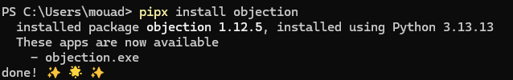
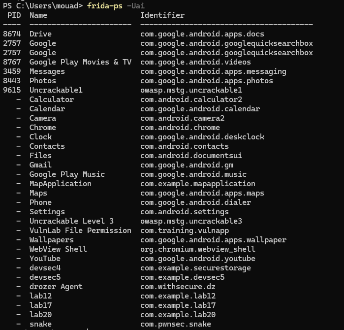
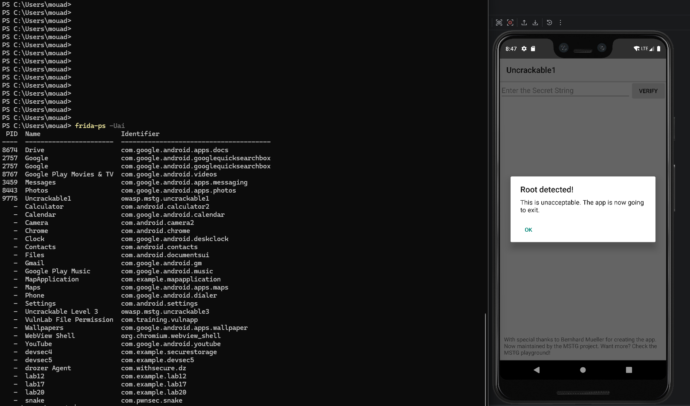
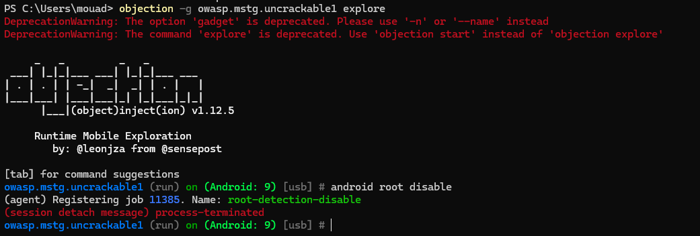

# Lab 13 - Bypass de détection root avec Objection

## Informations

- Auteur : Charaf
- Usage : support de lab personnel et académique.

## Objectif

Le but de ce lab est d'utiliser Objection avec Frida pour contourner une détection root dans une application Android.

Application utilisée : `Uncrackable1`  
Package : `owasp.mstg.uncrackable1`

## Installation d'Objection

Objection a été installé avec `pipx` :

```powershell
pipx install objection
```

La capture suivante montre que l'installation est terminée et que la commande `objection.exe` est disponible.



## Vérification de Frida et de l'application cible

Après avoir lancé `frida-server` sur l'appareil Android, j'ai vérifié depuis le PC que Frida voyait les applications avec :

```powershell
frida-ps -Uai
```

Dans la liste, on voit l'application cible :

```text
Uncrackable1    owasp.mstg.uncrackable1
```



## Test avant bypass

Avant d'utiliser Objection, l'application est lancée normalement sur l'émulateur.

Elle détecte que l'appareil est root et affiche le message :

```text
Root detected!
This is unacceptable. The app is now going to exit.
```

Cette capture prouve que la protection root est active.



## Bypass avec Objection

Ensuite, je lance Objection sur le package de l'application :

```powershell
objection -g owasp.mstg.uncrackable1 explore
```

Dans la console Objection, j'exécute la commande :

```text
android root disable
```

Cette commande installe des hooks Frida pour neutraliser plusieurs contrôles root côté Java, comme les recherches de fichiers `su`, certaines commandes système et des méthodes de détection root.

La console indique que le job `root-detection-disable` est enregistré.



## Résultat

La détection root est contournée en attachant Objection à l'application et en exécutant `android root disable`.

Le principe du bypass est que l'application continue de tourner, mais les contrôles root les plus courants sont interceptés par Frida avant de retourner leur résultat à l'application.

## Conclusion

Objection facilite le bypass des détections root Android côté Java. Dans ce lab, l'application `Uncrackable1` détecte le root avant instrumentation, puis Objection applique le module `android root disable` pour neutraliser cette détection.
